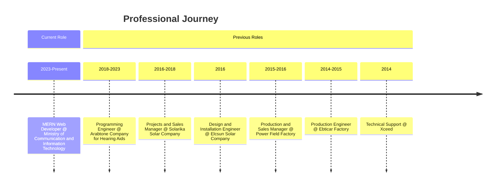
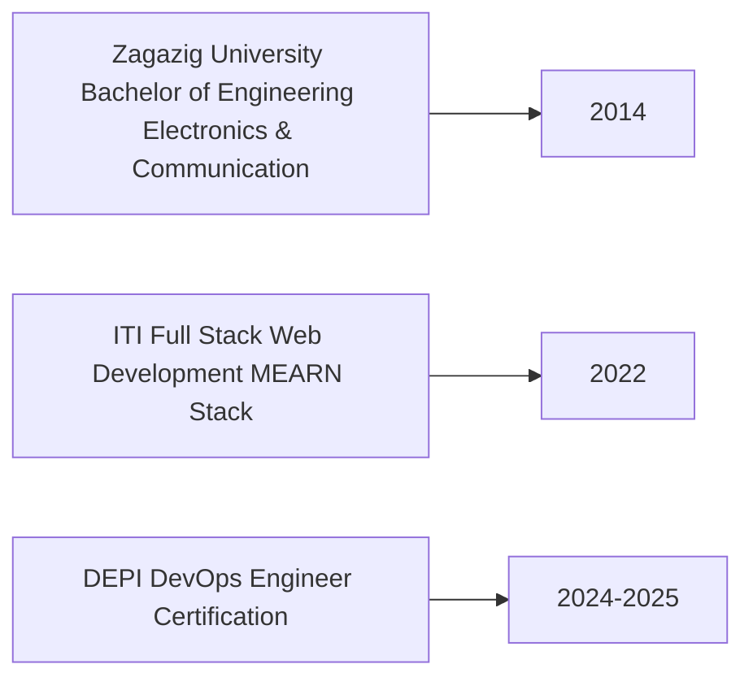

# Hi there! 👋 I'm Heba Mohammed Mostafa

<!-- Animated Header -->

  

<!-- Contact Badges -->

  
  
  
  

---

##  About Me

  

I'm a passionate **MERN Full Stack & DevOps Engineer** with a strong background in **Electronics & Communication Engineering**. Currently working as a MERN Web Developer at the Ministry of Communication and Information Technology, I specialize in building scalable web applications and implementing robust DevOps practices.

With over 9 years of professional experience across various domains, I bring a unique perspective that combines technical expertise with practical problem-solving skills. I'm committed to continuous learning and staying updated with the latest technologies in web development and cloud infrastructure.

---

## 🚀 Professional Experience

---
## 🛠 Technical Skills

  

## 🎓 Education & Certifications

---

## 💼 Featured Projects

<table>
<tr>
<td width="50%">

### 🎮 E-commerce Game Store
A comprehensive full-stack e-commerce platform featuring:
- User authentication & authorization
- Shopping cart & wishlist functionality
- Admin dashboard for inventory management
- Secure payment integration
- Image management with Cloudinary

**Tech Stack:**
 

</td>
<td width="50%">

### 📱 Social Media Application
A feature-rich social media platform with:
- JWT-based authentication
- CRUD operations for posts & comments
- Real-time interactions
- Media upload & management
- Responsive design

**Tech Stack:**
 

</td>
</tr>
<tr>
<td width="50%">

### 📸 User Albums Manager (Angular)
An Angular-based photo management application:
- User authentication system
- Album creation & management
- Photo upload & organization
- JSON Server backend integration

**Tech Stack:**
 

</td>
<td width="50%">

### 🛡️ Wa3i Digital Citizenship Platform
A comprehensive platform for digital citizenship education:
- ERD design & database architecture
- Full-stack implementation
- Educational content management
- Online safety resources

**Tech Stack:**
 

</td>
</tr>
</table>

---

## 📈 GitHub Statistics

  
  

  

---

## 🌟 What I'm Currently Working On

- 🔭 Building scalable web applications using the MERN stack
- 🌱 Expanding my DevOps expertise with advanced Kubernetes and AWS services
- 👯 Looking to collaborate on open-source projects
- 🎯 Focusing on cloud-native application development
- 📚 Continuous learning in emerging web technologies

---

## 📬 Let's Connect!

  

    
    
  

  
  

---

  

